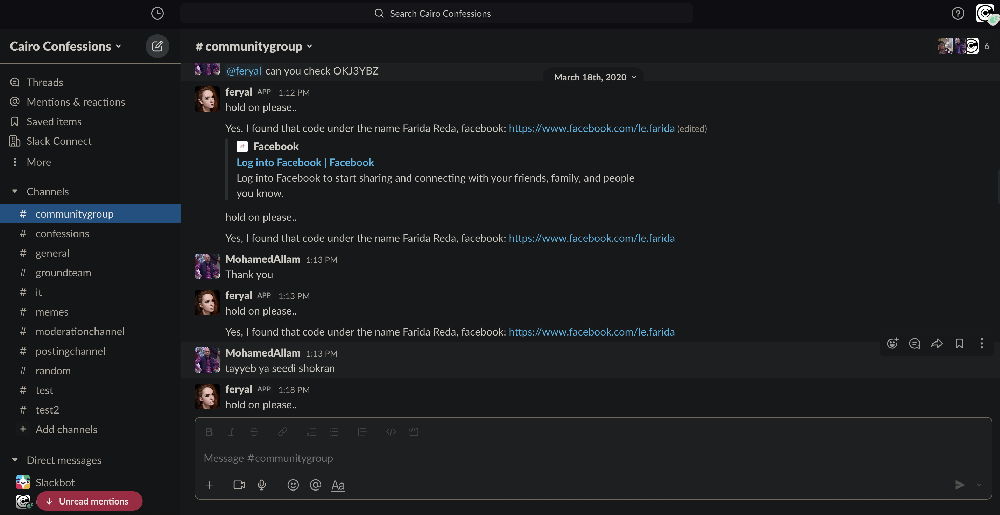
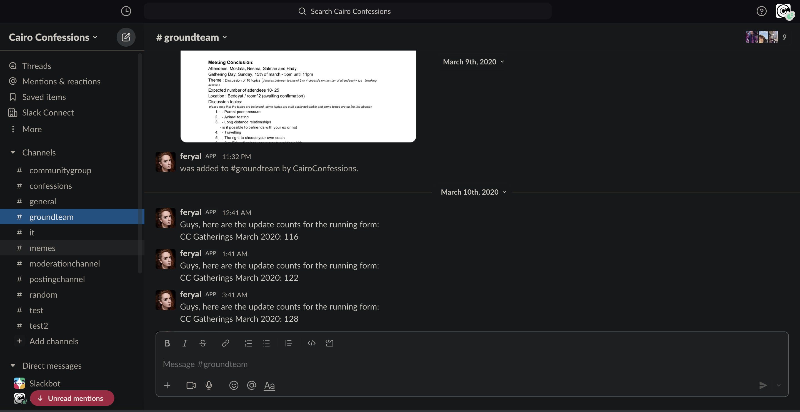

# Feryal-Slack-Bot
A simple client for Slack based on Slack API integrated with a script that acts as an interface for info and reminders from Google Sheets, Docs and Forms






## Table of Contents

* [Technologies](#technologies)
* [Installation](#installation)
* [Features](#features)
* [Questions](#questions)


## Technologies 

* Google Apps Script
* JavaScript ES6
* Lodash
* clasp

## Installation

To install this application, in VS code after cloning the repo, use [clasp CLI](https://developers.google.com/apps-script/guides/clasp) to create the .clasp.json file

```
clasp create [scriptTitle]
```

Then add the destination script id to the .clasp.json file and then push the code using the following command

```
clasp push
```


## Features

* Installable on slack
* Connects to Google Drive, Google Sheets and Google Forms via Google Apps Script
* Responds to requests by users
* Reminds users on slack channels of specific events and alerts about incidents
* Posts regular updates from live forms


## Questions 

If you have any more questions, please contact me here:

Github Username: [mohamedallam13](https://mohamedallam13.github.io/react-professional-portfolio/)

Email: [mohamedallam.tu@gmail.com](mailto:mohamedallam.tu@gmail.com)
